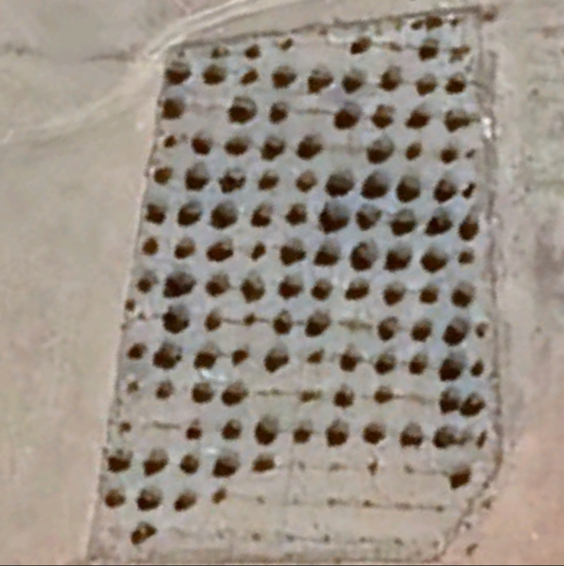

# Object_Detection_YOLO
## Introduction

In this Project we have used Yolov5s deep learning Model to detect and count the number of discrete trees from a given aerial image. Dataset was prepared by taking aerial images of trees from Google Earth Pro and then labelling trees using Python Libraray LabelImg. After Creating the dataset, we use Yolov5 which is a CNN-bases deep learning model for trees Detection.

## Methods
 - Satellite Images: Images were taken from Google earth Pro.
 

 - Image Labelling: Python library LabelImg is used to label images.
