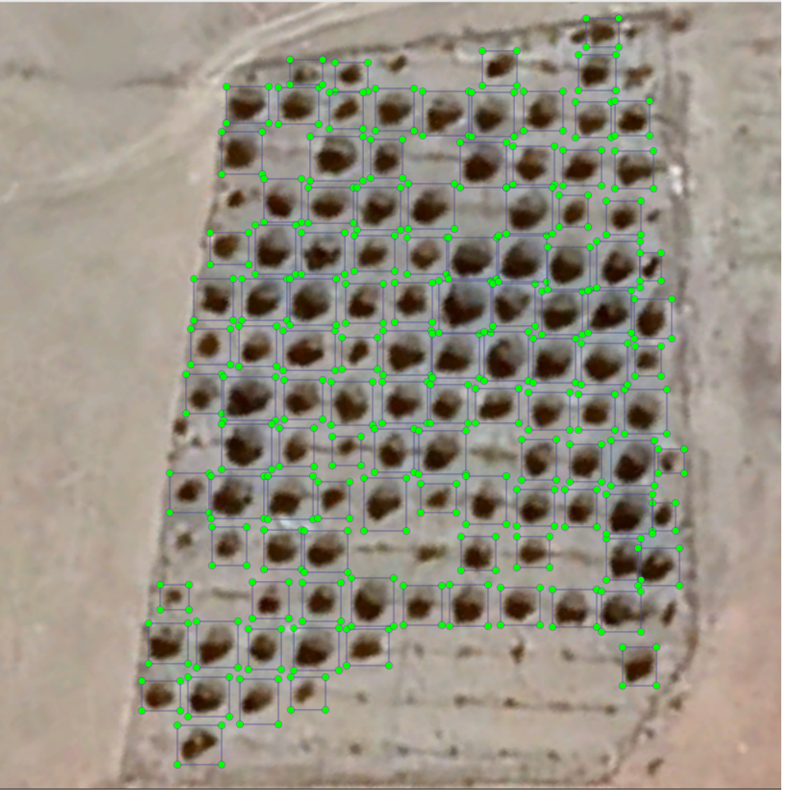

# Object_Detection_YOLO
## Introduction

In this Project we have used Yolov5s deep learning Model to detect and count the number of discrete trees from a given aerial image. Dataset was prepared by taking aerial images of trees from Google Earth Pro and then labelling trees using Python Libraray LabelImg. After Creating the dataset, we use Yolov5 which is a CNN-bases deep learning model for trees Detection.

## Methods
 - Satellite Images: Images were taken from Google earth Pro.
   
 

 - Image Labelling: Python library LabelImg is used to label images.

 

 - Model: I have used YOLOv5s Model in this project. The YOLO algorithm is important because of its
   speed, high accuracy, and learning capabilities. YOLOv5 uses PyTorch which makes the deployment of
   the model faster, easier and accurate. Everycode is written and run on Jupyter Notebook and good      hardware is needed to train the dataset, if you don't have good hardware then use Google Colab.

 - Result: We are getting nearly 100% result for the given image.

 
   
